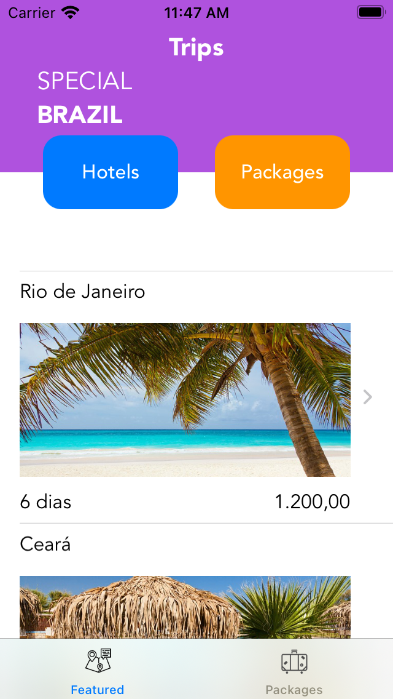

#  Trips
Trips app made with SwiftUI

## Motivation
This an iOS app that was created to show an example of implementation of a Trips app using the [SwiftUI](https://developer.apple.com/xcode/swiftui/) framework

## Resources

### 1. Responsiveness
The app layout was created to be responsive to the device that is running it. To achieve that, the sizing and alignment variables were defined in reason of the [Size-Class](https://developer.apple.com/library/archive/documentation/UserExperience/Conceptual/AutolayoutPG/Size-ClassSpecificLayout.html) of the device.
In SwiftUI to do that you should use the [UserInterfaceSizeClass](https://developer.apple.com/documentation/swiftui/userinterfacesizeclass) enum.

### 2. Localization
The app is prepared to be displayed in `English` and `Brazillian Portuguese`. To implement that, it was used the SwiftUI native components that support localization and created a `Localizable.strings` file with the proper translations.

### 3. Testing (TODO)
Will be implemented
